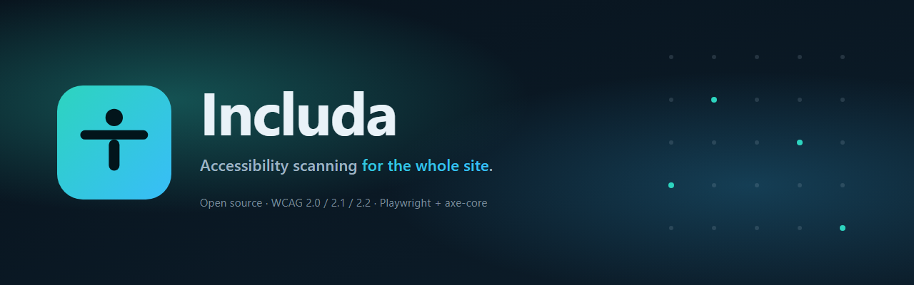
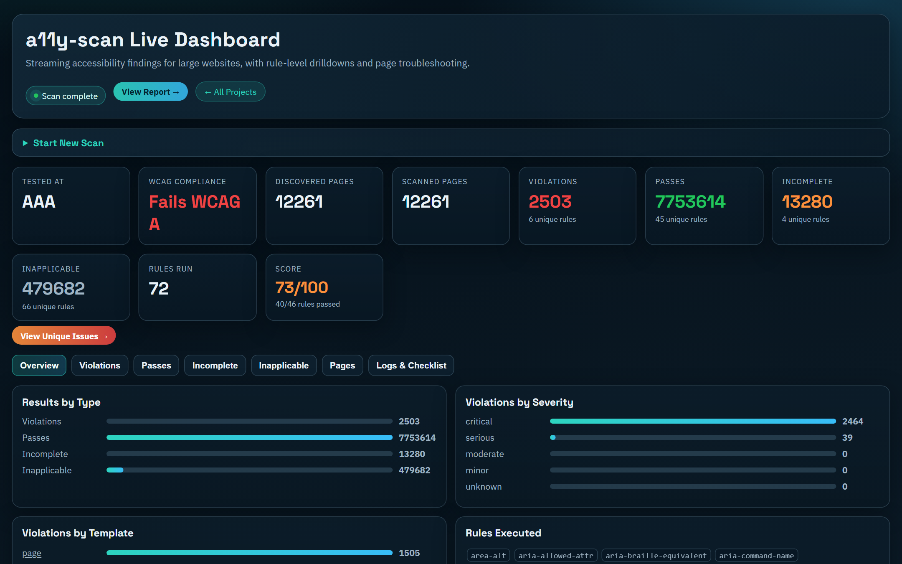
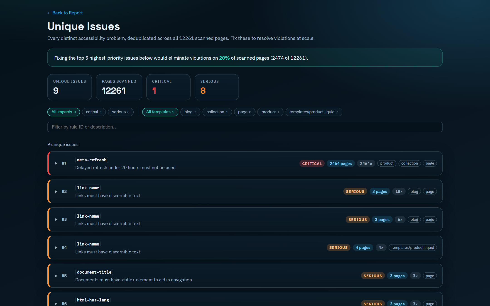
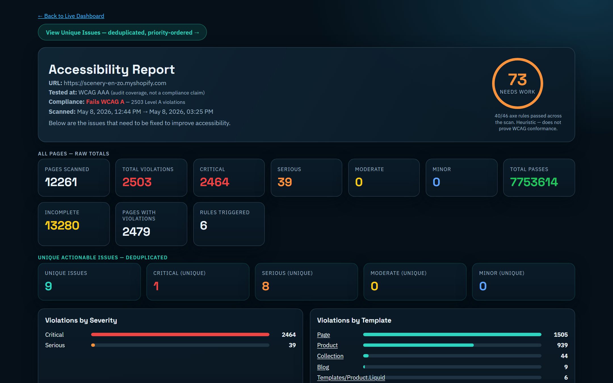

<div align="center">



<br />

[](LICENSE)
[](https://github.com/code-lodge/includa/releases/latest)
[](https://github.com/code-lodge/includa/actions)
[](https://github.com/code-lodge/includa/releases/latest)
[](https://playwright.dev)

**Open-source accessibility scanner that crawls every page of a website, audits against WCAG 2.0 / 2.1 / 2.2, deduplicates issues across templates, and generates AI-ready fix prompts.**

[Website](https://includa.app) · [Download](https://github.com/code-lodge/includa/releases/latest) · [Documentation](#documentation) · [Report a bug](https://github.com/code-lodge/includa/issues/new)

</div>

---

## Why Includa

Most a11y tools test one URL at a time. They tell you the homepage has 12 issues — they don't tell you whether those same 12 issues appear on the other 8,000 pages, or which template is responsible. Includa was built for sites with hundreds or thousands of pages.

A scan of a typical mid-size storefront produces hundreds of raw violations. Includa fingerprints them by rule + normalized selector, so the same broken pattern on 200 pages collapses into a single entry. You go from "fix 1,200 violations" to "fix 8 root causes," with the affected page count next to each.

<div align="center">
  
  <p align="center"><sub>The live dashboard during a completed scan</sub></p>
</div>

## Features

- 🌐 **Whole-site crawl** — discovers URLs from `sitemap.xml`, sitemap indexes, `robots.txt`, and BFS link traversal with configurable depth
- ♿ **WCAG 2.0 / 2.1 / 2.2** — Levels A, AA, and AAA via `@axe-core/playwright`, with binary compliance results plus a Lighthouse-style 0–100 quality score
- 🔍 **Smart deduplication** — collapses identical patterns across pages so the same broken footer link counts once, not 1,200 times
- 🧠 **CMS-aware** — detects WordPress (Block + Classic), Shopify (incl. PageFly), Drupal, Magento 2, Squarespace, HubSpot, Ghost — and tailors fix prompts to each platform
- 🤖 **AI Fix Prompts** — every unique issue ships with a copy-pasteable prompt containing selectors, screenshots, failure summary, and CMS context — paste into Claude or ChatGPT and get a real fix back
- 📊 **Live dashboard** — real-time scan progress, multi-project support, drill into any rule / template / page, stop and resume long crawls
- 🖼️ **Element screenshots** — red-outlined captures of each failing element so you can see what's broken without opening the page
- 📦 **Portable exports** — one-click ZIP of any completed scan as a self-contained static HTML site you can host anywhere
- ⚙️ **CI ready** — `--fail-on-critical` and `--fail-on-serious` exit codes for build gating
- 🔒 **Privacy-first** — runs entirely on your machine. No telemetry, no cloud, no account

## Quick start

### Desktop app (recommended)

Download the latest installer for your platform from the [releases page](https://github.com/code-lodge/includa/releases/latest):

| Platform | Download |
|---|---|
| Windows | `Includa-Setup-x.y.z.exe` (NSIS), `Includa-x.y.z.msi`, or `Includa-portable-x.y.z.exe` |
| macOS | `Includa-x.y.z-x64.dmg` (Intel) or `Includa-x.y.z-arm64.dmg` (Apple Silicon) |
| Linux | `Includa-x.y.z.AppImage` (run `chmod +x` first) |

Double-click to launch. The Chromium browser engine (~300 MB) downloads on first scan.

> **First-launch:** the binaries are not yet code-signed. Windows SmartScreen will warn — click *More info → Run anyway*. macOS Gatekeeper will block — right-click → *Open* the first time.

### Command line

```bash
git clone https://github.com/code-lodge/includa.git
cd includa
npm install

# Scan a single site
node bin/includa.js https://example.com

# Start the multi-project dashboard
node bin/includa.js --dashboard --port 4175
```

## Usage

### CLI examples

```bash
# Basic scan with defaults (max 2000 pages, concurrency 10, WCAG AAA)
includa https://example.com

# Tune for a large site
includa https://big-site.com \
  --concurrency 10 \
  --max-pages 5000 \
  --exclude cart checkout account \
  --report-dir ./reports/big-site

# Sample one page per template instead of every URL
includa https://huge-site.com --sample-templates 1

# Filter with regex
includa https://shop.com --include "re:/products/"
includa https://shop.com --exclude "re:^https://shop\.com/(cart|account)"

# CI: fail the build on any critical issue
includa https://staging.com --fail-on-critical

# Run the dashboard server (multi-project mode, persists between scans)
includa --dashboard --port 4175
```

Run `includa --help` for the full option list.

### Common options

| Flag | Default | Description |
|---|---|---|
| `--max-pages <n>` | `2000` | Maximum pages to scan |
| `--concurrency <n>` | `10` | Parallel page scans |
| `--wcag-level <level>` | `AAA` | `A`, `AA`, or `AAA` |
| `--exclude <patterns...>` | — | URL patterns to skip (supports `re:` prefix for regex) |
| `--include <patterns...>` | — | Only scan URLs matching these patterns |
| `--depth <n>` | `6` | Link-crawl depth |
| `--sample-templates <n>` | `0` | Sample N pages per detected template (0 = scan everything) |
| `--report-dir <dir>` | `./a11y-report` | Output directory |
| `--format <list>` | `html,json,csv` | Comma-separated formats |
| `--dashboard` | `false` | Start the multi-project dashboard server instead of a one-shot scan |
| `--fail-on-critical` | `false` | Exit code 2 if any critical violation found |
| `--fail-on-serious` | `false` | Exit code 2 if any serious violation found |

## Reports

Each scan produces a self-contained directory:

```
report/
├── index.html              ← Live dashboard (with running server)
├── report.html             ← Static report — score, severity, drilldown links
├── unique-issues.html      ← Deduplicated issues with AI Fix Prompts
├── pages/                  ← Per-page detail reports
├── rules/                  ← Per-rule detail reports
├── templates/              ← Per-template detail reports
└── raw/
    ├── results.json        ← Full violation data
    ├── results.csv         ← Flattened CSV for spreadsheets
    ├── unique-violations.json
    ├── page-details/       ← One JSON per scanned page
    └── screenshots/        ← Element screenshots with red-outline highlight
```

### Two ways to look at the same data

<table>
  <tr>
    <td width="50%" valign="top">
      <strong>Unique Issues view</strong><br />
      <sub>Deduplicated, sortable, filterable by impact and template. Each issue ships with an AI Fix Prompt.</sub><br /><br />
      
    </td>
    <td width="50%" valign="top">
      <strong>Static report</strong><br />
      <sub>One-page summary suitable for sharing with stakeholders. Score, compliance, severity breakdown, drilldowns.</sub><br /><br />
      
    </td>
  </tr>
</table>

## How scoring works

Includa surfaces two numbers because they answer different questions:

**Compliance** (binary)
> Does this site pass WCAG at level A / AA / AAA?

Computed from axe-core's WCAG-tagged violations. Even one Level A violation drops compliance to *Fails WCAG A*. There is no "89% AAA" — WCAG conformance is pass/fail per success criterion.

**Quality score** (Lighthouse-style 0–100)
> How are we trending?

Weighted percentage of axe rules passed:

```
score = Σ(weights of rules passed) / Σ(weights of all rules audited) × 100
weights = { critical: 10, serious: 7, moderate: 3, minor: 1 }
```

Same formula as Lighthouse's accessibility category. A site can score 89/100 and still fail WCAG A — the score is a heuristic, the compliance label is the truth.

## Architecture

```
bin/includa.js               Entry point — runs ensureBrowsers(), then bin/cli.js
bin/cli.js                   Commander-based CLI

src/
├── index.js                 runScan() orchestrator
├── crawler/                 URL discovery (sitemap, robots.txt, BFS, template sampling)
├── scanner/
│   ├── page-scanner.js      Concurrent page scans via Playwright pool
│   ├── axe-runner.js        axe-core injection + result collection
│   └── browser-pool.js      Playwright instance manager
├── analysis/
│   ├── deduplication.js     Fingerprint-based dedup
│   ├── cms/                 Per-platform template detection
│   └── template-detection.js
├── reporting/
│   ├── generate-reports.js  Report orchestrator
│   ├── html-dashboard.js    Live dashboard (index.html)
│   ├── static-report.js     Post-scan report.html
│   ├── unique-issues-report.js
│   ├── exporter.js          Self-contained ZIP export
│   ├── dashboard-server.js  Multi-project HTTP server
│   └── projects-home.js     Projects landing page
├── store/
│   └── project-store.js     JSON-backed project metadata
└── utils/

electron/
├── main.js                  Electron main process
├── loading.html             First-run splash
└── build/                   App icons (icon.ico, icon.icns, icon.png)
```

The CLI and the desktop app share the same scan engine — the desktop app just wraps the dashboard server in an Electron `BrowserWindow`.

## Development

```bash
git clone https://github.com/code-lodge/includa.git
cd includa
npm install

# Run the desktop app in dev mode
npm start

# Run the CLI directly
node bin/includa.js https://example.com

# Regenerate brand assets (after editing assets/icon.svg / assets/banner.svg)
node scripts/generate-assets.js

# Refresh README/website screenshots
node scripts/take-screenshots.js
```

### Building distributables

```bash
npm run build:win     # NSIS installer + MSI + portable .exe
npm run build:mac     # DMG (x64 + arm64)
npm run build:linux   # AppImage
```

CI builds all three via [`.github/workflows/release.yml`](.github/workflows/release.yml) on tag push (`v*`) and uploads to a draft release.

## Contributing

Issues, feature requests, and PRs are welcome. A few notes:

- Please open an issue before starting non-trivial work so we can align on scope.
- The project uses plain JavaScript (ESM), no transpiler. Node ≥ 18.
- No tests yet — validate with `node -c <file>` for syntax and a manual scan to confirm behavior.
- Commit messages: imperative, focused on *why* (e.g. *"Switch to Lighthouse-style scoring"*, not *"Update scoring code"*).

## Important Disclaimer

This is an automated technical scanning tool designed for informational purposes only. It does not provide legal advice, ADA certification, or guarantee compliance with any accessibility laws or regulations. For legal compliance verification, consult with qualified accessibility professionals.

## License

[GPL-3.0](LICENSE) © Code Lodge

Includa is built on top of these open-source projects:

- [Playwright](https://playwright.dev) — browser automation (Apache-2.0)
- [axe-core](https://github.com/dequelabs/axe-core) — accessibility rule engine (MPL-2.0)
- [Electron](https://electronjs.org) — cross-platform desktop runtime (MIT)

---

<div align="center">
  <a href="https://includa.app">
    
  </a>
  <br />
  <sub><a href="https://includa.app">includa.app</a> · made with ♿ + 🤖</sub>
</div>
